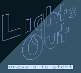
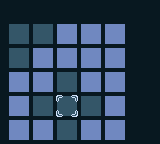

# GB Lights Out

My Game Boy version of the 1995 handheld electronic game, Lights Out! This project scratches both of my itches of 1) learning an assembly language and 2) getting into game development.

I wanted to make this game because I love this style of board / cell-flipping puzzle games. It's also simple enough for someone new at assembly and Game Boy development to attempt, but still has implications challenging enough to be able to learn about many facets of this type of development.

Challenges I've run into and learned from, thus far:

- Representing and working with a grid (effectively, a 2D array) in assembly (my favorite problem so far!)
- Designing and displaying custom tilemaps
- General hardware management (waiting for VBlanks, updating screen appropriately, etc)
- Reading and updating memory dynamically, and having changes reflected on screen
- Sprite movement

## Road Map

- [x] Start screen
- [ ] Level engine
  - [x] Print level grid
  - [x] Ability to move cursor
  - [x] Flip tiles on click
  - [x] Win condition check
  - [ ] Level HUD (number of moves)
  - [ ] Win screen
- [ ] Save states
- [ ] Level select screen
  - [x] Print "box" for each level
  - [ ] Level select cursor
  - [ ] Start level on click
  - [ ] Display completion state of levels
- [ ] Credits
- [ ] Tutorial

## Screenshots

